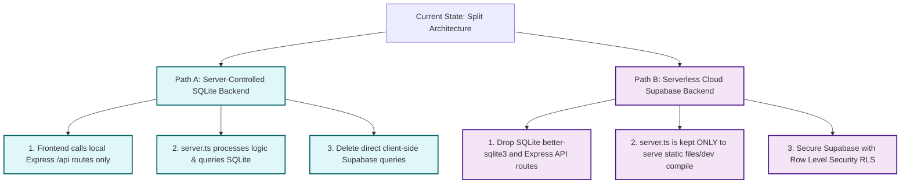

# UniFlow: Backend Architectural Evaluation & Security Recommendations

This report evaluates whether the current backend architecture is robust, secure, and ready for production, and outlines concrete, step-by-step paths to make it rock-solid.

---

## 1. Executive Architectural Audit

In its current state, **the backend architecture is not solid enough** for production or scaling. While individual parts (Express/SQLite and Supabase Client SDK) are well-written, their integration contains structural flaws, security risks, and dead code patterns.

### Major Architectural Issues Identified:

#### 🚨 1. Dual-Backend Conflict (Split Personality)
The codebase implements two separate database systems and two separate API designs concurrently. 
* **The Conflict:** Your React frontend uses `@supabase/supabase-js` to directly write to and read from a remote Supabase cluster. Concurrently, your Express server (`server.ts`) implements a local SQLite database (`uniflow.db`) and a full set of CRUD routes (`/api/notes`, `/api/todos`, `/api/budgets`, `/api/reminders`).
* **The Consequence:** There is **zero synchronization** between the databases, and the entire Express/SQLite API layer represents completely unused "dead code" in the codebase, which bloated package size and increases maintenance.

#### 🔒 2. Critical Authentication Security Vulnerability
In your local Express API routing logic, the authentication middleware (`authenticateToken` inside `server.ts`) decodes the incoming Supabase JWT token like this:
```typescript
const decoded: any = jwt.decode(token);
if (!decoded || !decoded.sub) return res.sendStatus(403);
req.user = { id: decoded.sub, email: decoded.email };
```
* **The Vulnerability:** `jwt.decode()` merely extracts the token payload *without* validating its cryptographic signature. 
* **The Risk:** If you ever begin calling this local API, any malicious actor could forge a fake JWT token containing a spoofed user ID (`sub`), send it in the headers, and gain complete access to view, edit, or delete any other user's records. To be secure, it must verify the signature using your Supabase JWT Secret with `jwt.verify(token, process.env.SUPABASE_JWT_SECRET)`.

#### 🧩 3. Data Integration Gaps
Because Supabase and SQLite are completely decoupled:
* Storing profile avatars or uploading attachments to Supabase Storage works in the frontend, but the local SQLite database has no knowledge of it.
* Synchronizing data across devices or offline storage becomes impossible without writing heavy duplication layers.

---

## 2. Choosing Your Path: How to Solidify the Backend

To establish a solid, clean, and secure architecture, you must choose **one** primary backend path and eliminate the other.



### 🛣️ Option A: The "Server-Controlled / Local-First" Approach
This approach turns your local Express server into the single controller of your database. The frontend talks only to the server, and the server queries the database.

* **Key Changes Required:**
  1. Refactor all React views (`Notes.tsx`, `Todos.tsx`, `BudgetTracker.tsx`, etc.) to replace `supabase.from('...')` queries with standard browser `fetch` or `axios` HTTP requests pointing to your Express backend (e.g. `GET /api/notes`, `POST /api/todos`).
  2. Drop the `@supabase/supabase-js` dependency from your frontend entirely.
  3. Secure your Express endpoints by using standard cookie-based sessions or implementing proper cryptographic JWT token signature verification.
* **Pros:** Complete control over your business logic, secure database credentials, offline-capable locally, and a clean, traditional API structure.
* **Cons:** You must manually write migrations, handle backups, and build authentication from scratch if you scale up.

---

### 🛣️ Option B: The "Serverless Cloud / Pure Supabase" Approach
This approach embraces the cloud-first model. Your Express server is strictly used as a static asset server, and your frontend interacts securely with Supabase.

* **Key Changes Required:**
  1. Strip out the local SQLite schema setup, `better-sqlite3` imports, and all `/api/*` REST endpoints from `server.ts`.
  2. Keep `server.ts` **only** for serving your static built client-side SPA (Vite dev server and production static hosting).
  3. Ensure **Row Level Security (RLS)** is enabled on all tables in your Supabase Dashboard, writing database policies that restrict users so they can only read and write rows matching their own `auth.uid()`.
* **Pros:** No server-side maintenance, instant database scaling, pre-built high-security email/password/social auth, and built-in realtime sync features.
* **Cons:** Vendor lock-in to Supabase cloud infrastructure, and less control over raw server hardware behavior.

---

## 3. Recommended Action Plan

| Rank | Decision | Next Steps |
| :--- | :--- | :--- |
| **Option B (Recommended for Speed/Scale)** | **Cloud-First** | 1. Enable RLS on all Supabase tables.<br>2. Delete SQLite code in `server.ts` to clean up the repository.<br>3. Remove unused Express API packages. |
| **Option A (Recommended for Offline/Local Control)** | **Local-First** | 1. Convert React queries from `supabaseClient` to local Express `fetch` requests.<br>2. Set up cryptographically secure JWT verification inside `server.ts`. |

---

> [!TIP]
> **Need help executing one of these options?**
> Recommend running the `/grill-me` slash command to clarify your preference, or ask me directly to write a step-by-step refactoring plan to clean up `server.ts` or convert frontend fetches.
