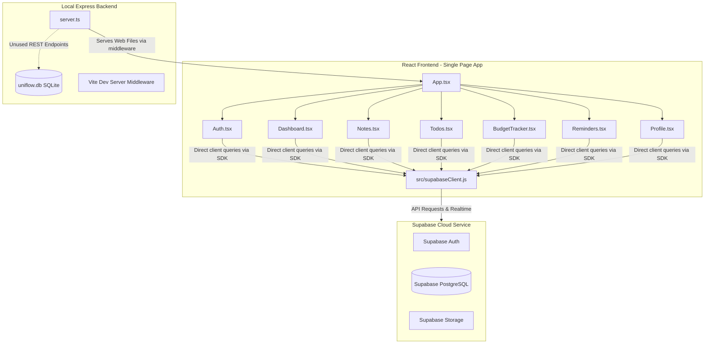

# UniFlow: Technical Architecture & System Integration Report

This document provides a comprehensive technical overview of the UniFlow codebase. It maps out the frontend-to-backend architecture, details both parallel database schemas, explains the current integration gaps, lists file dependencies, and details the impact of modifications.

---

## 1. System Architecture & Data Flow

During our deep-dive analysis of the UniFlow codebase, we identified a highly unique **parallel backend architecture**. The frontend client is fully powered by **Supabase Cloud**, while a local **Express & SQLite** backend exists concurrently but is currently bypassed by frontend queries.

### Key Integrations:
1. **Frontend-to-Supabase Direct Integration:** The React components (`Notes.tsx`, `Todos.tsx`, `BudgetTracker.tsx`, etc.) import `supabase` from `src/supabaseClient.js` and query Supabase tables and storage **directly** using the `@supabase/supabase-js` SDK.
2. **Express & SQLite Server (`server.ts`):** `server.ts` is an Express application running locally on port `3000`. It initializes a local SQLite database (`uniflow.db`) and defines a full set of Express REST endpoints under `/api/*` (e.g., `/api/notes`, `/api/todos`). **However, the frontend never calls any of these `/api/` endpoints.** 
3. **The Role of Express:** In development, the Express server mounts Vite as a middleware (`createViteServer`) to compile and serve the frontend files. In production, it serves the compiled static `dist` folder. 

---

## 2. Database Schemas

Because there are two database engines in play, here are both schemas and how they correspond:

### Schema A: The Local SQLite Schema (Defined in `server.ts`)
Stored in `uniflow.db` and managed via `better-sqlite3`.

| Table | Columns | Details / Relationships |
| :--- | :--- | :--- |
| **`users`** | `id` (TEXT PRIMARY KEY) `email` (TEXT UNIQUE) `name` (TEXT) `settings` (TEXT JSON DEFAULT '{}') | Holds local user cache |
| **`notes`** | `id` (INTEGER AUTOINCREMENT) `userId` (TEXT) `title` (TEXT) `content` (TEXT) `folder` (TEXT DEFAULT 'General') `createdAt` (DATETIME) `updatedAt` (DATETIME) | `FOREIGN KEY(userId) REFERENCES users(id)` |
| **`todos`** | `id` (INTEGER AUTOINCREMENT) `userId` (TEXT) `task` (TEXT) `completed` (INTEGER 0/1) `dueDate` (DATETIME) | `FOREIGN KEY(userId) REFERENCES users(id)` |
| **`budgets`** | `id` (INTEGER AUTOINCREMENT) `userId` (TEXT) `category` (TEXT) `amount` (REAL) `type` (TEXT 'income'/'expense') `date` (DATETIME) | `FOREIGN KEY(userId) REFERENCES users(id)` |
| **`reminders`** | `id` (INTEGER AUTOINCREMENT) `userId` (TEXT) `title` (TEXT) `remindAt` (DATETIME) `priority` (TEXT 'High'/'Medium'/'Low') `completed` (INTEGER 0/1) | `FOREIGN KEY(userId) REFERENCES users(id)` |

---

### Schema B: Supabase Cloud Schema (Queried by Frontend)
Located in your Supabase PostgreSQL cluster.

| Table | Structure (Inferred from Client Queries) | Relationships & Assets |
| :--- | :--- | :--- |
| **`profiles`** | `id` (UUID PRIMARY KEY) `name` (TEXT) `avatar_url` (TEXT) `settings` (JSONB) | Maps to Supabase auth user |
| **`notes`** | `id` (BIGINT PRIMARY KEY) `user_id` (UUID) `title` (TEXT) `content` (TEXT) `folder` (TEXT) `cover_url` (TEXT) `attachments` (JSONB Array) `created_at` (TIMESTAMPTZ) `updated_at` (TIMESTAMPTZ) | Includes paths to `app-files` storage bucket for cover/attachments |
| **`todos`** | `id` (BIGINT PRIMARY KEY) `user_id` (UUID) `task` (TEXT) `completed` (BOOLEAN) `due_date` (TIMESTAMPTZ) `created_at` (TIMESTAMPTZ) | Used in `Todos.tsx` |
| **`budgets`** | `id` (BIGINT PRIMARY KEY) `user_id` (UUID) `category` (TEXT) `amount` (NUMERIC) `type` (TEXT 'income'/'expense') `date` (TIMESTAMPTZ) | Used in `BudgetTracker.tsx` |
| **`reminders`** | `id` (BIGINT PRIMARY KEY) `user_id` (UUID) `title` (TEXT) `remind_at` (TIMESTAMPTZ) `priority` (TEXT) `completed` (BOOLEAN) | Used in `Reminders.tsx` |

---

## 3. Candidate Files Impact Analysis

Depending on which file you were specifically referring to by **"this file"**, here are the exact impact assessments:

### Candidate A: `server.ts` (Express Backend Entry Point)

* **Role:** Serves the frontend application assets and manages the local SQLite database.
* **Direct Dependencies:**
  * `express` (routing & HTTP server)
  * `vite` / `createViteServer` (development server compiler)
  * `better-sqlite3` (SQLite engine)
  * `bcryptjs` (password hashing)
  * `jsonwebtoken` (JWT decoder/sign)
  * `dotenv` (environment variables)
* **What happens if you modify it?**
  * **The REST APIs (`/api/*`):** You can change, refactor, or delete the `/api/notes`, `/api/todos`, `/api/budgets`, and `/api/reminders` endpoints completely **without compromising the frontend application**. The frontend does not consume these endpoints.
  * **The Vite Dev/Static Server Config:** If you modify lines `227–244` (Vite middleware setup and server listening code) incorrectly, **the application will fail to start** or serve pages, breaking both dev (`npm run dev`) and production environments.
* **Verdict:** You have complete freedom to change 90% of `server.ts` (especially the database logic and API routes) without breaking anything, as long as you preserve the static asset routing and host listening blocks.

---

### Candidate B: `src/supabaseClient.js` (Supabase Client Config)

* **Role:** Exports the authenticated `supabase` client used by every frontend feature.
* **Direct Dependencies:**
  * `@supabase/supabase-js` (Supabase SDK)
* **What happens if you modify it?**
  * **Highly Sensitive:** If you change the exported client name, break the import, or supply incorrect API keys, **100% of the active database and storage operations in the frontend will immediately fail**.
* **Verdict:** Do not modify the structure of this file. If you need to change Supabase targets, update the `.env` file instead of altering the client instantiation code in `supabaseClient.js`.

---

### Candidate C: `src/App.tsx` (Frontend Entry Point)

* **Role:** Boots up the application session, verifies Supabase sessions, manages state for themes, and routes the views.
* **Direct Dependencies:**
  * `supabaseClient.js` (auth checks & profile storage)
  * `lucide-react` (icon UI library)
  * `motion` / `motion/react` (sidebar & transition animations)
  * `components/*` (Dashboard, Notes, Todos, BudgetTracker, Reminders, Profile, Auth)
* **What happens if you modify it?**
  * Modifying the view-routing state logic (`activeView`) can break page transition logic.
  * Modifying `initSession` (lines `81–189`) can cause infinite loading spin loops or prevent users from logging in or staying logged in.
* **Verdict:** You can customize styling and sidebar navigation layout safely, but exercise high caution around the session initialization state and event hooks.

---

## 4. Next Steps & Recommendations

Would you like to:
1. **Unify the Architectures?** We can refactor the React frontend to actually call the local Express backend `/api/*` endpoints rather than directly querying Supabase, which would make the Express/SQLite server the true backend.
2. **Clean Up `server.ts`?** We can strip out the unused database logic in `server.ts` to keep the codebase clean and minimal.
3. **Integrate new features?** 

> [!TIP]
> You can use the `/grill-me` command to have an interactive session to plan major refactorings, or `/goal` for complex automation tasks.
